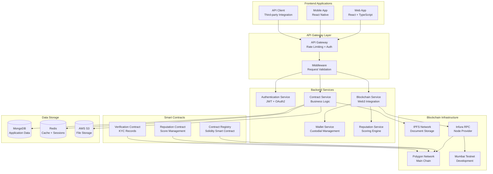
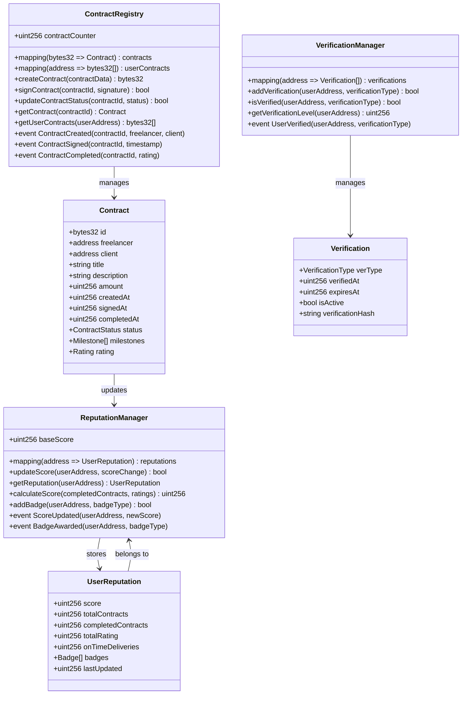
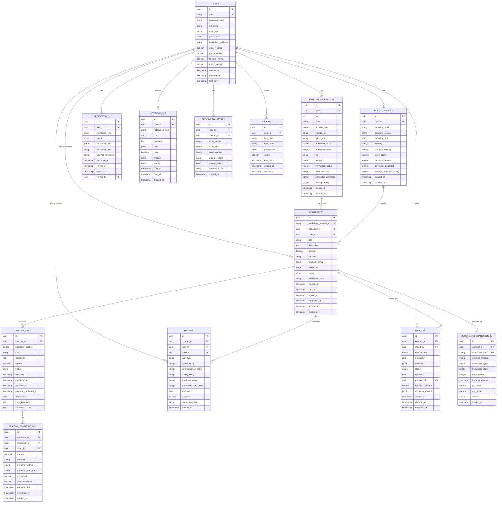
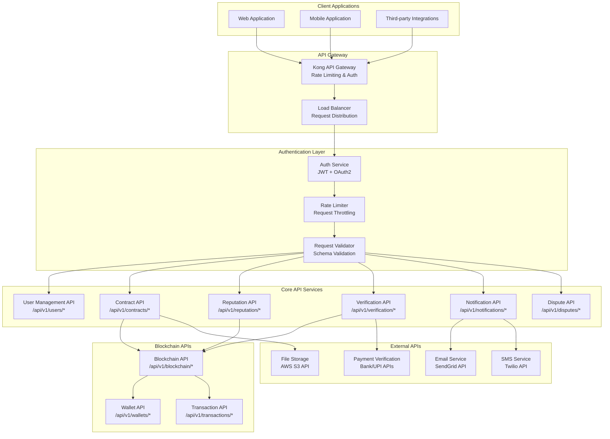
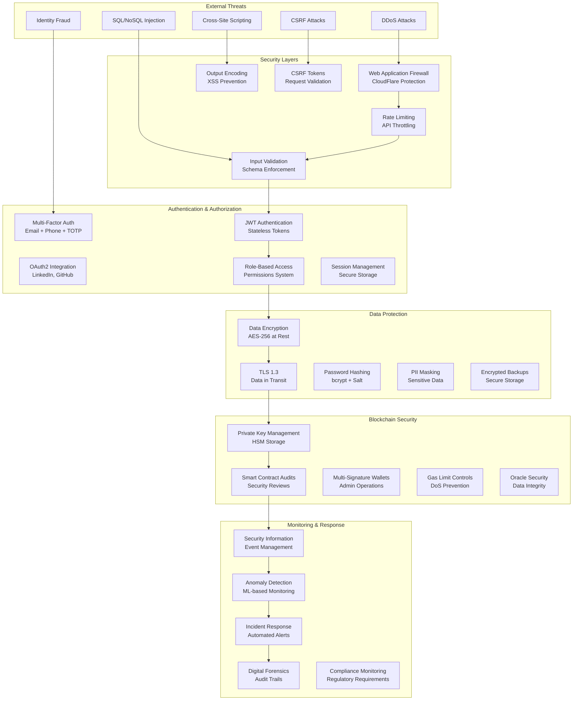
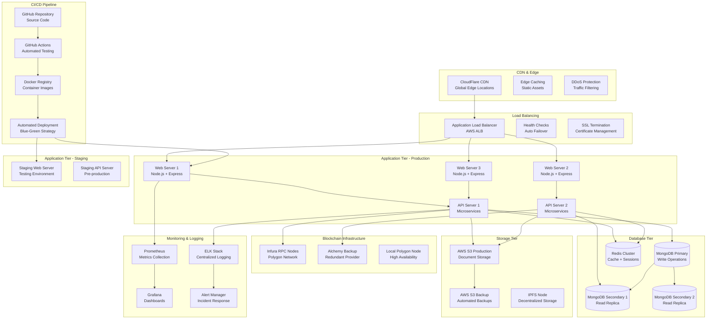
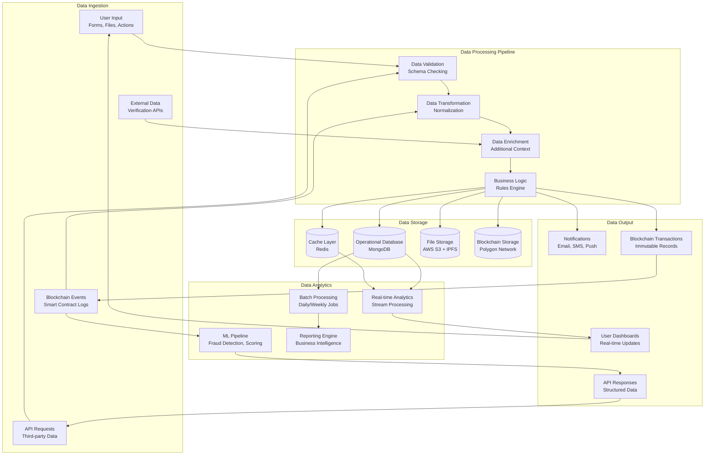

# Technical Architecture Diagrams - Decentralized Freelancer Trust Platform

## 1. Blockchain Integration Architecture

## 2. Smart Contract Architecture

## 3. Database Schema & Relationships

## 4. API Architecture & Endpoints

## 5. Security Architecture

## 6. Deployment & Infrastructure Architecture

## 7. Data Flow & Processing Architecture

