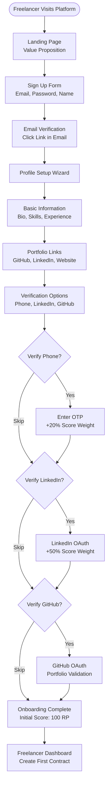
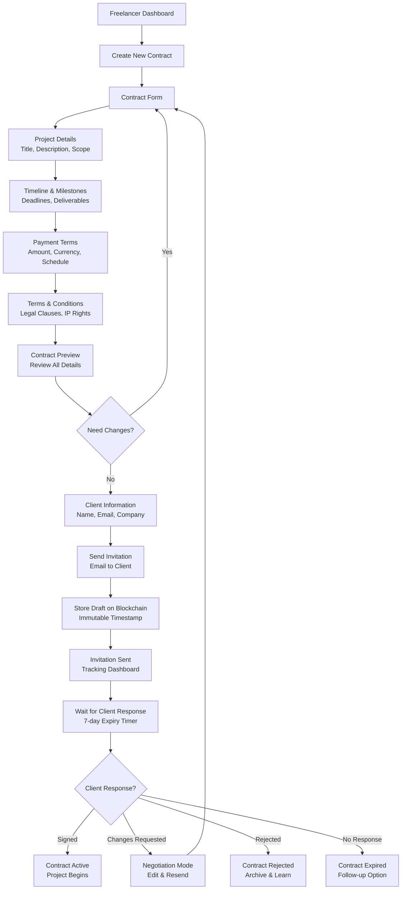
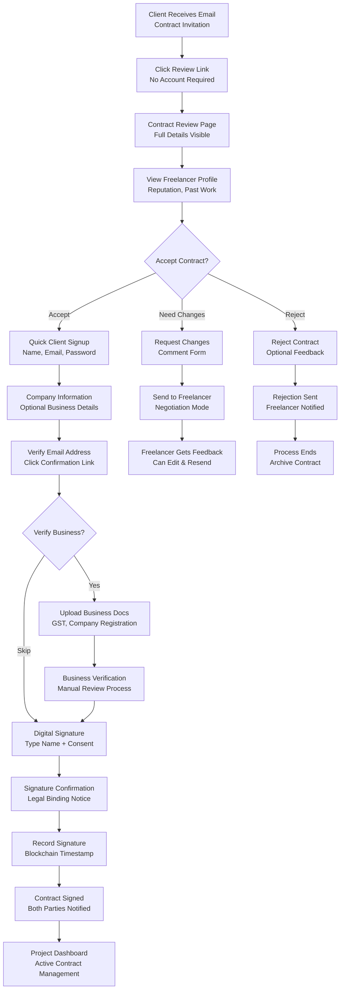
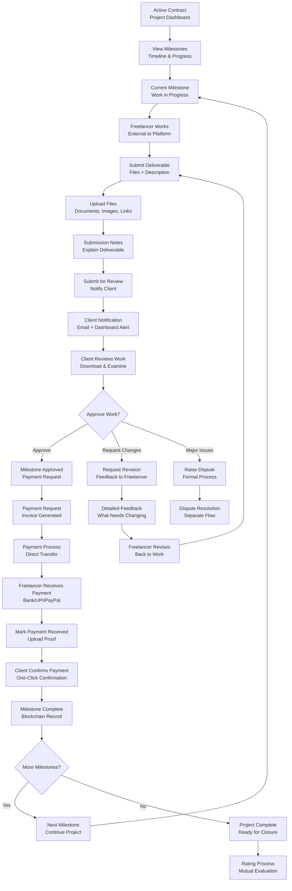

# User Flow Diagrams - Decentralized Freelancer Trust Platform

## 1. Freelancer Onboarding Flow

## 2. Contract Creation & Client Invitation Flow

## 3. Client Contract Review & Signing Flow

## 4. Project Management & Milestone Flow

## 5. Rating & Contract Closure Flow

```mermaid
flowchart TD
    PROJECT_COMPLETE[All Milestones Complete<br/>Payment Confirmed] --> CLOSURE_INIT[Initiate Contract Closure<br/>System Notification]
    
    CLOSURE_INIT --> CLIENT_RATING[Client Rating Form<br/>Rate Freelancer Work]
    CLIENT_RATING --> RATING_CATEGORIES[Rating Categories<br/>Quality, Communication, Timeliness]
    RATING_CATEGORIES --> OVERALL_SCORE[Overall Score<br/>1-10 Scale]
    OVERALL_SCORE --> WRITTEN_FEEDBACK[Written Feedback<br/>Optional Testimonial]
    WRITTEN_FEEDBACK --> RATING_SUBMIT[Submit Rating<br/>Confirm & Send]
    
    RATING_SUBMIT --> FREELANCER_RATING[Freelancer Rating Form<br/>Rate Client Experience]
    FREELANCER_RATING --> CLIENT_CATEGORIES[Client Categories<br/>Communication, Payment, Clarity]
    CLIENT_CATEGORIES --> CLIENT_SCORE[Client Score<br/>1-10 Scale]
    CLIENT_SCORE --> CLIENT_FEEDBACK[Client Feedback<br/>Optional Review]
    CLIENT_FEEDBACK --> FL_RATING_SUBMIT[Submit Client Rating<br/>Mutual Evaluation]
    
    FL_RATING_SUBMIT --> SCORE_CALCULATION[Calculate Reputation Update<br/>Weighted Algorithm]
    SCORE_CALCULATION --> BONUS_CHECK[Check Bonus Multipliers<br/>Verified Client, Early Delivery]
    BONUS_CHECK --> PENALTY_CHECK[Check Penalties<br/>Late Delivery, Issues]
    PENALTY_CHECK --> FINAL_SCORE[Final Score Calculation<br/>Update Reputation Points]
    
    FINAL_SCORE --> BLOCKCHAIN_RECORD[Record on Blockchain<br/>Immutable Rating & Score]
    BLOCKCHAIN_RECORD --> TIER_UPDATE[Update Tier & Badges<br/>Elite, Trusted, Verified]
    TIER_UPDATE --> PROFILE_UPDATE[Update Public Profile<br/>New Score & Testimonial]
    
    PROFILE_UPDATE --> CONTRACT_CLOSED[Contract Officially Closed<br/>Success Notification]
    CONTRACT_CLOSED --> PORTFOLIO_UPDATE[Portfolio Enhancement<br/>Add Completed Project]
    PORTFOLIO_UPDATE --> SHARE_PROFILE[Share Updated Profile<br/>Future Client Outreach]
    
    SHARE_PROFILE --> ANALYTICS[View Analytics<br/>Score Trends, Performance]
    ANALYTICS --> NEXT_PROJECT[Ready for Next Project<br/>Enhanced Credibility]
```

## 6. Dispute Resolution User Flow

```mermaid
flowchart TD
    ISSUE_ARISES[Project Issue<br/>Payment/Quality/Communication] --> WHO_RAISES{Who Raises Dispute?}
    
    WHO_RAISES -->|Freelancer| FL_DISPUTE[Freelancer Raises Dispute<br/>Payment/Scope Issues]
    WHO_RAISES -->|Client| CL_DISPUTE[Client Raises Dispute<br/>Quality/Delivery Issues]
    
    FL_DISPUTE --> FL_EVIDENCE[Freelancer Evidence<br/>Chat Logs, Work Samples]
    CL_DISPUTE --> CL_EVIDENCE[Client Evidence<br/>Requirements, Communications]
    
    FL_EVIDENCE --> DISPUTE_FORM[Dispute Form<br/>Issue Type & Description]
    CL_EVIDENCE --> DISPUTE_FORM
    
    DISPUTE_FORM --> EVIDENCE_UPLOAD[Upload Evidence<br/>Screenshots, Files, Messages]
    EVIDENCE_UPLOAD --> DISPUTE_SUBMIT[Submit Dispute<br/>Formal Process Begins]
    
    DISPUTE_SUBMIT --> OTHER_PARTY[Notify Other Party<br/>Response Required]
    OTHER_PARTY --> RESPONSE_TIME[48-Hour Response<br/>Counter-Evidence]
    
    RESPONSE_TIME --> AUTO_ANALYSIS[Automated Analysis<br/>Contract Terms Check]
    AUTO_ANALYSIS --> CLEAR_VIOLATION{Clear Contract Violation?}
    
    CLEAR_VIOLATION -->|Yes| AUTO_RESOLUTION[Automatic Resolution<br/>Apply Contract Terms]
    CLEAR_VIOLATION -->|No| HUMAN_REVIEW[Human Mediator Review<br/>Manual Investigation]
    
    AUTO_RESOLUTION --> RESOLUTION_APPLIED[Apply Resolution<br/>RP Adjustment/Refund]
    
    HUMAN_REVIEW --> MEDIATOR_CONTACT[Mediator Contacts Parties<br/>Gather More Information]
    MEDIATOR_CONTACT --> MEDIATION_CALL[Optional Mediation Call<br/>Discuss Resolution]
    MEDIATION_CALL --> MEDIATOR_DECISION[Mediator Decision<br/>Binding Resolution]
    
    MEDIATOR_DECISION --> PARTIES_ACCEPT{Both Parties Accept?}
    PARTIES_ACCEPT -->|Yes| RESOLUTION_APPLIED
    PARTIES_ACCEPT -->|No| ESCALATION_OPTION[Legal Escalation Option<br/>Evidence Package]
    
    ESCALATION_OPTION --> EVIDENCE_PACKAGE[Generate Evidence Package<br/>Blockchain Proofs + Docs]
    EVIDENCE_PACKAGE --> LEGAL_TEMPLATE[Legal Notice Template<br/>Small Claims Court Ready]
    LEGAL_TEMPLATE --> EXTERNAL_LEGAL[External Legal Process<br/>Outside Platform]
    
    RESOLUTION_APPLIED --> BLOCKCHAIN_LOG[Log Resolution<br/>Immutable Record]
    BLOCKCHAIN_LOG --> REP_IMPACT[Reputation Impact<br/>Score Adjustments]
    REP_IMPACT --> DISPUTE_CLOSED[Dispute Closed<br/>Both Parties Notified]
    
    EXTERNAL_LEGAL --> PLATFORM_SUPPORT[Platform Provides Support<br/>Evidence & Documentation]
```

## 7. Verification Process Flow

```mermaid
flowchart TD
    PROFILE_SETUP[User Profile Setup<br/>Basic Information] --> VERIFY_OPTIONS[Verification Options<br/>Multiple Tiers Available]
    
    VERIFY_OPTIONS --> EMAIL_VERIFY[Email Verification<br/>Required for All Users]
    EMAIL_VERIFY --> EMAIL_SENT[Verification Email Sent<br/>Click Link to Confirm]
    EMAIL_SENT --> EMAIL_CONFIRMED[Email Confirmed<br/>Basic Verification Complete]
    
    EMAIL_CONFIRMED --> PHONE_OPTION{Verify Phone Number?}
    PHONE_OPTION -->|Yes| PHONE_INPUT[Enter Phone Number<br/>Country Code + Number]
    PHONE_OPTION -->|Skip| SOCIAL_OPTIONS[Social Media Verification<br/>LinkedIn, GitHub]
    
    PHONE_INPUT --> PHONE_OTP[Send OTP<br/>SMS Verification Code]
    PHONE_OTP --> OTP_INPUT[Enter OTP Code<br/>6-Digit Verification]
    OTP_INPUT --> OTP_VALID{Valid OTP?}
    OTP_VALID -->|No| OTP_RETRY[Retry OTP<br/>3 Attempts Max]
    OTP_VALID -->|Yes| PHONE_VERIFIED[Phone Verified<br/>+20% Score Weight]
    
    OTP_RETRY --> PHONE_OTP
    PHONE_VERIFIED --> SOCIAL_OPTIONS
    
    SOCIAL_OPTIONS --> LINKEDIN_OPTION{Verify LinkedIn?}
    LINKEDIN_OPTION -->|Yes| LINKEDIN_OAUTH[LinkedIn OAuth<br/>Connect Account]
    LINKEDIN_OPTION -->|Skip| GITHUB_OPTION{Verify GitHub?}
    
    LINKEDIN_OAUTH --> LINKEDIN_PROFILE[Fetch LinkedIn Profile<br/>Work History, Connections]
    LINKEDIN_PROFILE --> LINKEDIN_VALIDATE[Validate Profile<br/>Real Person Check]
    LINKEDIN_VALIDATE --> LINKEDIN_VERIFIED[LinkedIn Verified<br/>+50% Score Weight]
    
    LINKEDIN_VERIFIED --> GITHUB_OPTION
    GITHUB_OPTION -->|Yes| GITHUB_OAUTH[GitHub OAuth<br/>Connect Repository]
    GITHUB_OPTION -->|Skip| BUSINESS_OPTION{Business Verification?}
    
    GITHUB_OAUTH --> GITHUB_REPOS[Analyze Repositories<br/>Code Quality, Activity]
    GITHUB_REPOS --> GITHUB_SCORE[GitHub Score<br/>Portfolio Validation]
    GITHUB_SCORE --> GITHUB_VERIFIED[GitHub Verified<br/>Technical Credibility]
    
    GITHUB_VERIFIED --> BUSINESS_OPTION
    BUSINESS_OPTION -->|Yes| BUSINESS_DOCS[Upload Business Documents<br/>GST, Registration, PAN]
    BUSINESS_OPTION -->|Skip| VERIFICATION_COMPLETE[Verification Complete<br/>Calculate Final Score]
    
    BUSINESS_DOCS --> DOC_REVIEW[Document Review<br/>Manual Verification]
    DOC_REVIEW --> DOC_VALID{Documents Valid?}
    DOC_VALID -->|No| DOC_REJECTED[Documents Rejected<br/>Resubmit Required]
    DOC_VALID -->|Yes| BUSINESS_VERIFIED[Business Verified<br/>Premium Client Status]
    
    DOC_REJECTED --> BUSINESS_DOCS
    BUSINESS_VERIFIED --> VERIFICATION_COMPLETE
    
    VERIFICATION_COMPLETE --> SCORE_CALCULATION[Calculate Verification Score<br/>Weighted Algorithm]
    SCORE_CALCULATION --> BADGE_ASSIGNMENT[Assign Verification Badges<br/>Trusted, Elite, Verified]
    BADGE_ASSIGNMENT --> PROFILE_UPDATE[Update Public Profile<br/>Show Verification Status]
    PROFILE_UPDATE --> VERIFICATION_DONE[Verification Process Complete<br/>Enhanced Credibility]
```

